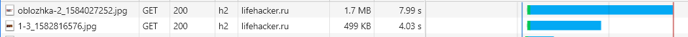
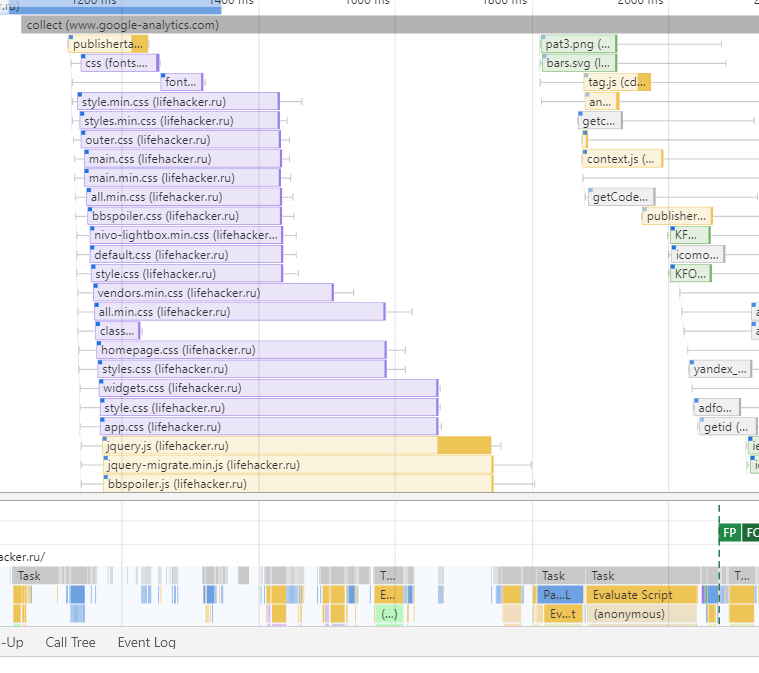
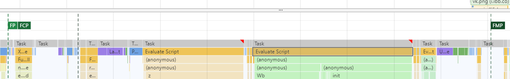
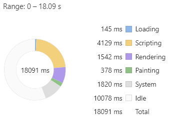
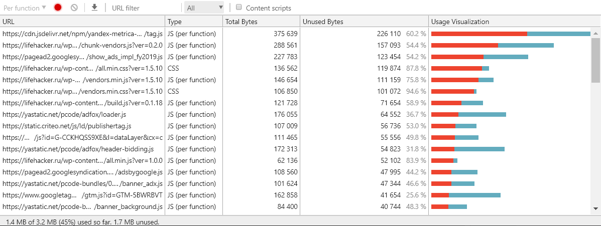
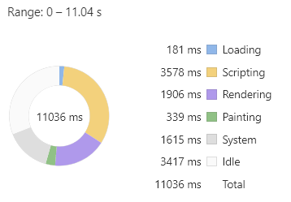

# Задание "Использование браузерных DevTools"

## Найти неоптимальные места:
* дублирование ресурсов
    - явно есть дублирование стилей (файлы с одинаковым именем и различной версией)
    - дублирование запросов скриптов аналитики \ рекламы

* лишний размер ресурса
    - огромные картинки для фона карточки статьи. 
     
    - Вообще все остальные используемые картинки можно тоже ужать.
    - Подключены стили bootstrap и многие из них не используются.
    - Многие подключенные стилевые файлы вообще не используются
    
* медленно загружающиеся ресурсы
    - Сама страница грузится довольно долго, после ее загрузки начинается скачивание кучи стилей
    
* ресурсы, блокирующие загрузку
    - огромное количество стилей блокируют First Paint
    
    - скрипты аналитики выполняются ~0.5s и вызывают перерендер 
    
    
* что-то ещё
    - Много файлов, но так как используется HTTP 2.0, то это не проблема, 
    а наоборот улучшение кэширования.
    - Слишком много запросов по рекламе\аналитике (70 запросов). 

## Performance
* распределение по стадиям в процессе загрузки:
     
* First Paint - 2074.4 ms, First Meaningful Paint - 3107.3 ms, DOM Content Loaded - 4969.9 ms, Load - 15077.8 ms

## Coverage
 
* Используется только 51.7 KB из 438 KB (12%) стилей
* Используется только 1.4 MB из 2.8 MB (50%) скриптов

## Дополнительное исследование
Так как страница выглядит нашпиговонной аналитикой \ рекламой, 
то было решено с помощью функции Override заменить все скрипты аналитики \ рекламы на пустые файлы и посмотреть, что изменилось.

Итого: 
 

First Paint - 1716.8 ms, First Meaningful Paint - 2899.7 ms, DOM Content Loaded - 4495.8 ms, Load - 10260.7 ms ms
Видно, что цифры в среднем уменьшились на 300ms, а полная загрузка сократилась на 5 секунд.
